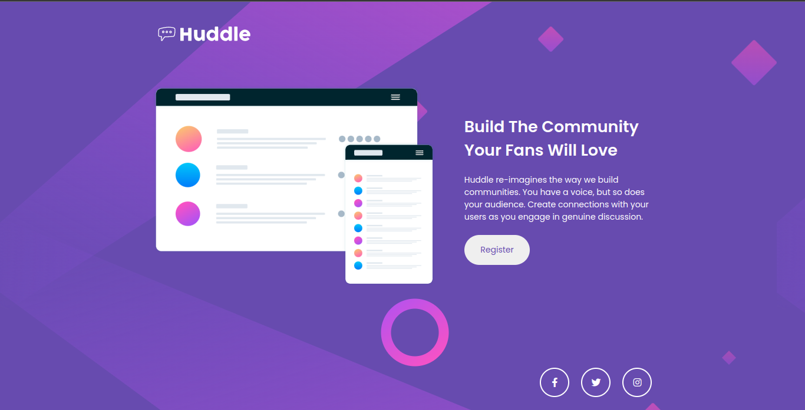

# Frontend Mentor - Landing Page

Esta é uma solução para o [desafio da página inicial do Huddle com uma única seção introdutória no Frontend Mentor](https://www.frontendmentor.io/challenges/huddle-landing-page-with-a-single-introductory-section-B_2Wvxgi0) . Os desafios do Frontend Mentor ajudam você a melhorar suas habilidades de codificação criando projetos realistas.

## Índice

- [Visão geral](#visão geral)
  - [O desafio](#the-challenge)
  - [Captura de tela](#captura de tela)
  - [Links](#links)
- [Meu processo](#meu-processo)
  - [Construído com](#construído com)
- [Autor](#autor)

## Visão geral

### O desafio

Os usuários devem ser capazes de:

- Visualize o layout ideal para a página, dependendo do tamanho da tela do dispositivo
- Veja os estados de foco para todos os elementos interativos na página

### Captura de tela

### Links

- URL da solução: [https://github.com/esdrasspessoa/landingPage](https://your-solution-url.com)
- URL do site ao vivo: [https://esdrasspessoa.github.io/htmlCss/landingPage/](https://your-live-site-url.com)

## Meu processo

### Construído com

- Marcação HTML5 semântica
- Propriedades personalizadas de CSS
- Flexbox
- CSS GRID
- Fluxo de trabalho mobile-first
- SASS

## Autor

- Site - [https://github.com/esdrasspessoa//](https://www.your-site.com)

- Mentor de frontend - [https://www.frontendmentor.io/profile/esdrasspessoa](https://www.frontendmentor.io/profile/seunomedeusuário)

  
